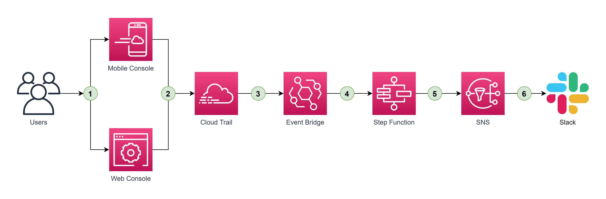
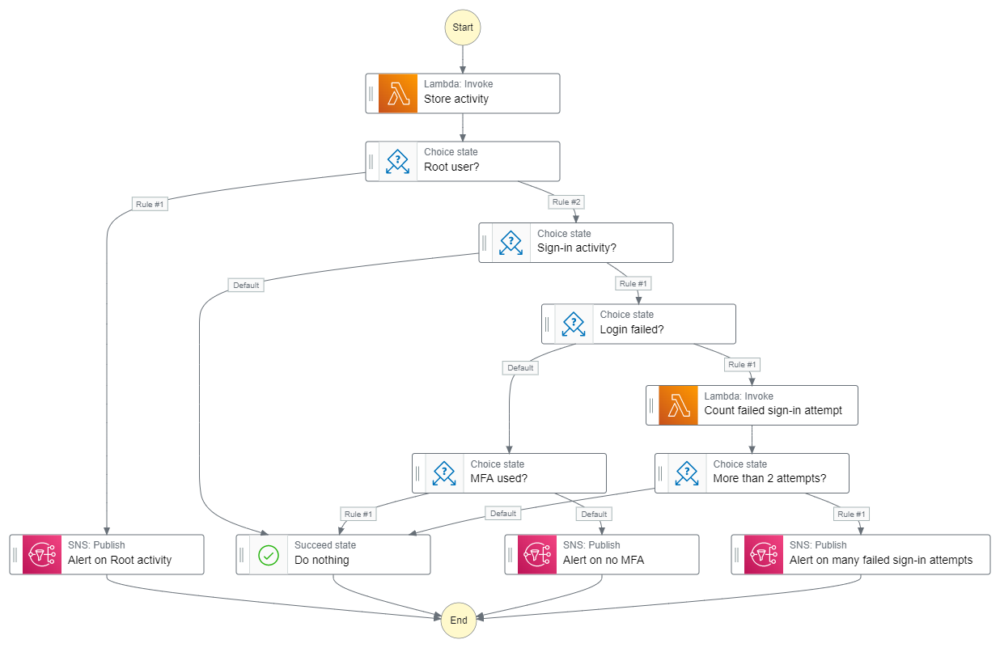

# Tracking and Notifying on AWS Sign-in activities

Here is the high-level architecture of the solution


1. IAM users and/or Root account sign-in to either Web Console or Mobile Console
2. That sign-in activity is captured and tracked by Cloud Trail
3. A Cloud Trail event is sent to Event Bridge automatically
4. Event Bridge triggers a state machine in Step Function
5. The state machine process the event and send a message SNS topic if needed
6. SNS with a Lambda function subscribed to the topic will send appropriate notifications Slack


Details of the state machine - the main part of the solution



This project is set up like a standard Python project. The initialization
process also creates a virtualenv within this project, stored under the `.venv`
directory.  To create the virtualenv it assumes that there is a `python3`
(or `python` for Windows) executable in your path with access to the `venv`
package. If for any reason the automatic creation of the virtualenv fails,
you can create the virtualenv manually.

To manually create a virtualenv on MacOS and Linux:

```
$ python3 -m venv .venv
```

After the init process completes and the virtualenv is created, you can use the following
step to activate your virtualenv.

```
$ source .venv/bin/activate
```

If you are a Windows platform, you would activate the virtualenv like this:

```
% .venv\Scripts\activate.bat
```

Once the virtualenv is activated, you can install the required dependencies.

```
$ pip install -r requirements.txt
```

At this point you can now synthesize the CloudFormation template for this code.

```
$ cdk synth
```

To add additional dependencies, for example other CDK libraries, just add
them to your `setup.py` file and rerun the `pip install -r requirements.txt`
command.

## Useful commands

 * `cdk ls`          list all stacks in the app
 * `cdk synth`       emits the synthesized CloudFormation template
 * `cdk deploy`      deploy this stack to your default AWS account/region
 * `cdk diff`        compare deployed stack with current state
 * `cdk docs`        open CDK documentation
